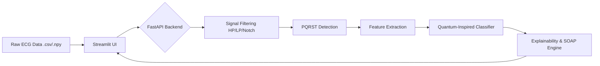

# MedQuantum-NIN 🫀

**AI-powered ECG analysis with PQRST detection, explainable diagnosis, and SOAP generation (FastAPI + Streamlit)**

A professional, offline clinical support system designed for cardiologists, researchers, and biomedical engineers to instantly analyze ECG waveforms, visualize morphological features, and generate structured medical reports.

<div align="center">
  
</div>

---

## 🔗 Live Demo
- **Frontend**: https://your-app.onrender.com
- **API Docs**: https://your-backend.onrender.com/docs

---

## ✨ Features at a Glance

* 🔬 **Intelligent Filtering**: Real-time High-Pass, Low-Pass, and IIR Notch filtering for clinical-grade signal cleaning.
* 📈 **PQRST Detection**: Automatic detection and semantic visualization of R, P, Q, S, and T peaks utilizing `neurokit2`.
* 🧠 **Quantum-Inspired Diagnostic Engine**: Explainable probabilistic modeling mapping morphological features to cardiovascular states.
* 📝 **Automated SOAP Notes**: Instant clinical reporting (Subjective, Objective, Assessment, Plan) with one-click export.
* ⚡ **High-Performance Architecture**: Built on top of a lightning-fast JSON API utilizing FastAPI.

---

## 🛠 Architecture

<div align="center">

</div>

---

## 🚀 Quickstart

It takes less than 60 seconds to get the system running locally.

### 1. Install Dependencies
```bash
git clone https://github.com/Tonyteja369/MedQuantum-NIN.git
cd MedQuantum-NIN
pip install -r requirements.txt
```

### 2. Run the System (One Command)
**Linux / macOS:**
```bash
bash run.sh
```

**Windows:**
```cmd
run.bat
```

* **Frontend Dashboard:** `http://localhost:8501`
* **Backend API Docs:** `http://localhost:8000/docs`
* **Health Check:** `http://localhost:8000/health`

---

## 💡 How It Works

MedQuantum-NIN operates via a strict analytical pipeline ensuring clinical relevance at every step:
* **Filtering:** Removes 50Hz/60Hz powerline noise, baseline wander (<0.5 Hz), and high-frequency artifacts.
* **PQRST Detection:** Leverages `neurokit2` spatial algorithms to accurately delineate ECG complex bounds.
* **Feature Extraction:** Computes exact intervals for RR, PR, QRS, and QT segments natively in milliseconds.
* **Probabilistic Model:** A "quantum-inspired" layer where we model multiple diagnostic hypotheses (Normal, Tachycardia, Bradycardia) as weighted states. We apply synthetic phase shifts corresponding to QRS/QT structural abnormalities, allowing states to creatively interfere before selecting the final diagnosis via normalized likelihood (state collapse).
* **Explainability:** Converts the backend vector logic into natural language rationale.

---

## 📊 Sample Output
<div align="center">
  
  
</div>

The API returns deeply structured, serializable JSON that easily integrates into larger hospital systems:
```json
{
  "heart_rate": 69.91,
  "features": {
    "rr_interval": 0.858,
    "pr_interval": 0.174,
    "qrs_duration": 0.084,
    "qt_interval": 0.288
  },
  "diagnosis": "Normal",
  "probabilities": {
    "normal": 0.8466,
    "tachycardia": 0.0552,
    "bradycardia": 0.0982
  },
  "explanation": "The model diagnosed the ECG as Normal. This is supported by a resting heart rate of 69.91 BPM...",
  "soap_note": "SOAP Note - Date: 2026-04-25..."
}
```

---

## 🚧 Limitations & Future Work
While highly capable, the current system is designed as a foundational proof-of-concept for intelligent ECG analysis:
- **Limited Condition Support:** Currently only classifies Normal, Tachycardia, and Bradycardia. Future updates will introduce Atrial Fibrillation (AFib) and STEMI models.
- **Dataset Dependency:** Synthetic distributions dictate the current state normalization. Next versions will feature a fully trained PyTorch/TensorFlow classifier dynamically fine-tuned on the MIT-BIH Arrhythmia Database.
- **Multi-Lead Support:** The pipeline is currently optimized for single-lead signals and will be expanded to interpret 12-lead standard clinical ECGs.
